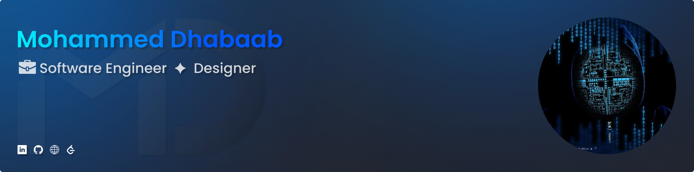

## 
😊 About Me

With you Mohammed is an enthusiastic and dedicated software engineer with a driven passion for developing high-quality and user-centered solutions. I am committed 100% to continuously enhancing my expertise, knowledge, and skills within software engineering and entrepreneurship to deliver impactful results!

Currently, I am developing solutions and honing my skills more as usual! I aim to consistently deliver high value through top-quality, user-centered solutions and make a positive impact each day!

 Looking for collaboration on projects!

## ✨ Skills

### Frontend Skills

### Backend Skills

### Other Skills

### Design Skills

 

## 📊 Stats

### GitHub Stats

  <!--  -->
  <!--  -->

### Leetcode Stats

<!--
 
-->

<!-- Proudly created with GPRM ( https://gprm.itsvg.in ) -->

<!-- Proudly created with GPRM ( https://gprm.itsvg.in ) -->

<!--
**Mohammed-Aldhabaab/Mohammed-Aldhabaab** is a ✨ _special_ ✨ repository because its `README.md` (this file) appears on your GitHub profile.

Here are some ideas to get you started:

- 🔭 I’m currently working on ...
- 🌱 I’m currently learning ...
- 👯 I’m looking to collaborate on ...
- 🤔 I’m looking for help with ...
- 💬 Ask me about ...
- 📫 How to reach me: ...
- 😄 Pronouns: ...
- ⚡ Fun fact: ...
-->
